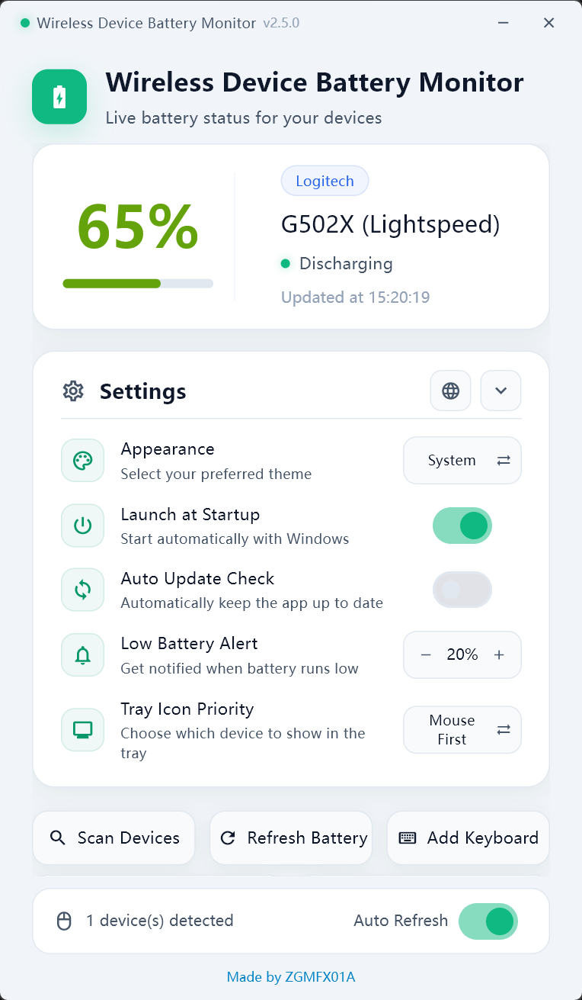

# Wireless Device Battery Monitor — Windows Mouse, Keyboard and Bluetooth Battery Monitor

[简体中文](README.md)

**Wireless Device Battery Monitor** is a lightweight Windows system-tray battery monitor for Logitech, Razer, and ASUS ROG wireless mice and keyboards, mechanical keyboards, and Windows-paired Bluetooth LE devices that expose the standard Battery Service. See battery percentage, charging state, last update time, and low-battery alerts without keeping a vendor control panel open.

## Download

- [Download the latest Windows build from GitHub Releases](https://github.com/ZGMFX01A/mouse-battery/releases)
- [Browse all releases and release notes](https://github.com/ZGMFX01A/mouse-battery/releases)

Download `WirelessDeviceBatteryMonitor-<version>.exe` and run it directly. No installer is required; the app stays in the Windows system tray.

## Product screenshot

The screenshot shows multi-device battery cards, charging state, low-battery threshold, startup launch, automatic updates, tray icon priority, and manual refresh. It uses the English UI; the app can switch between English and Simplified Chinese.

## Why Wireless Device Battery Monitor?

- **At-a-glance battery status**: See device name, battery percentage, charging state, and last update time from the tray or settings window.
- **Built for wireless peripherals**: Designed for Logitech, Razer, and ASUS ROG 2.4 GHz / Omni wireless mice and compatible HID devices.
- **Low-battery notifications**: Choose Off, 10%, 20%, or 30% and avoid unexpected power loss during work or gaming.
- **Multiple devices**: Show several detected devices and bind multiple Windows-paired standard BLE battery devices.
- **Keyboard support**: Read and bind battery status for ASUS ROG wireless keyboards (direct / Omni) and Weikav (Huafenda) dual-8K mechanical keyboard solutions.
- **Quiet background utility**: Device scanning, manual refresh, session auto-refresh, startup launch, and bilingual UI in a small tray application.
- **Optional auto-update**: Check GitHub Releases and update the packaged app when you enable the option.

The project is also useful as a Windows mouse battery monitor, wireless mouse battery checker, Logitech battery monitor, Razer battery monitor, ASUS ROG battery monitor, HID battery utility, system tray battery app, or Bluetooth LE battery monitor.

## Supported devices

### Razer wireless mice

| Device | Connection | Status |
| --- | --- | --- |
| Basilisk V3 Pro | 2.4 GHz wireless dongle | ✅ Verified |
| Viper V2 Pro | 2.4 GHz wireless dongle | 🔧 Theoretical support |
| DeathAdder V3 Pro | 2.4 GHz wireless dongle | 🔧 Protocol support |
| DeathAdder V3 | 2.4 GHz wireless dongle | 🔧 Protocol support |
| Viper Ultimate | 2.4 GHz wireless dongle | 🔧 Protocol support |
| Basilisk X Hyperspeed | 2.4 GHz wireless dongle | 🔧 Protocol support |
| Basilisk Ultimate | 2.4 GHz wireless dongle | 🔧 Protocol support |
| DeathAdder V2 Pro | 2.4 GHz wireless dongle | 🔧 Protocol support |

### Logitech wireless mice

| Device | Connection | Status |
| --- | --- | --- |
| G903 | LIGHTSPEED | ✅ Supported |
| G502 X | LIGHTSPEED | ✅ Supported |
| G703 | LIGHTSPEED | 🔧 Theoretical support |
| G Pro Wireless | LIGHTSPEED | 🔧 Theoretical support |

Logitech G HUB may occupy the HID interface needed for battery reads. If a Logitech device is not detected, close G HUB and select **Refresh Battery**. The current code enumerates known Lightspeed, Bolt, and Unifying receiver PIDs; the paired mouse still needs to expose a readable HID++ battery feature.

### ASUS ROG 2.4 GHz / Omni wireless mice

| Device Series / Model | Connection | Status |
| --- | --- | --- |
| ROG Harpe Ace Series (Aim Lab / Extreme / Mini / II Ace) | 2.4 GHz dongle / Omni Receiver | ✅ Supported |
| ROG Keris Series (Wireless / AimPoint / II Ace / Origin) | 2.4 GHz dongle / Omni Receiver | ✅ Supported |
| ROG Gladius III Series (Wireless / AimPoint / EVA-02) | 2.4 GHz dongle / Omni Receiver | ✅ Supported |
| ROG Gladius II Wireless / Strix Carry | 2.4 GHz dongle | ✅ Supported |
| ROG Chakram / Chakram X Wireless | 2.4 GHz dongle | ✅ Supported |
| ROG Spatha X Wireless | 2.4 GHz dongle | ✅ Supported |
| ROG Pugio II / Strix Impact II / Impact III | 2.4 GHz dongle / Omni Receiver | ✅ Supported |

Direct 2.4 GHz mice and Omni mice are detected automatically. The battery percentage syncs automatically when the mouse is powered on or wakes from sleep. When the mouse is powered off or asleep, the card explicitly displays **Not connected or asleep** without fabricating historical battery levels.

### ASUS ROG wireless mechanical keyboards

| Device Series / Model | Connection | Status |
| --- | --- | --- |
| ROG Azoth Series (Azoth / Extreme / Extreme SE / X) | 2.4 GHz dongle / Omni Receiver | ✅ Supported (via "Add keyboard") |
| ROG Strix Scope Series (Scope RX TKL / Scope II 96 / 96 RX) | 2.4 GHz dongle / Omni Receiver | ✅ Supported (via "Add keyboard") |
| ROG Falchion RX Low Profile | Omni Receiver | ✅ Supported (via "Add keyboard") |

Both direct 2.4 GHz and Omni keyboards can be identified and bound with a single click in Settings via **Add keyboard**. The card indicates offline/sleeping state whenever the keyboard goes to sleep or disconnects.

### Bluetooth LE devices

The app supports devices that are already paired with Windows and expose the standard Bluetooth Battery Service:

- Battery Service: `GATT 0x180F`
- Battery Level: `GATT 0x2A19`
- Multiple devices can be added; sleeping devices remain in the picker

Devices that use a vendor-private Bluetooth protocol or do not expose battery data to Windows are outside the current support boundary.

### Weikav dual-8K mechanical keyboards

Current support targets the Weikav (Huafenda) dual-8K receiver path over a 2.4 GHz dongle. Because a keyboard may expose multiple HID interfaces, use **Add keyboard** in Settings to complete a one-time manual binding.

## Quick start

1. Open [Releases](https://github.com/ZGMFX01A/mouse-battery/releases) and download the latest `WirelessDeviceBatteryMonitor-<version>.exe`.
2. Launch the executable and confirm that the Wireless Device Battery Monitor icon appears in the Windows system tray.
3. Connect the mouse or keyboard through its 2.4 GHz receiver; pair BLE devices in Windows first.
4. Wait for the first scan, then select **Refresh battery** when needed.
5. Hover over the tray icon or open Settings to inspect detailed status.

If Windows SmartScreen blocks the unsigned executable on first launch, verify that the file came from this repository's Releases page before selecting **More info → Run anyway**.

## Common tasks

### View battery status

The settings window shows device name, battery percentage, charging state, and update time for each device. Choose the tray icon priority that fits your workflow:

- Mouse first
- Keyboard first
- Lowest battery first

### Configure low-battery alerts

Use the minus/plus control in Settings to choose Off, 10%, 20%, or 30%. Windows shows a low-battery notification when a device reaches the threshold; changing the threshold recalculates notification state.

### Control auto-refresh

The **Auto Refresh** switch controls the current settings-window session and is enabled by default. The GUI reads shared state from the tray process about every 3 seconds, while the tray hardware poll runs every 60 seconds by default. This session switch is not persisted and returns to enabled after restart.

### Add a Bluetooth LE device

1. Pair the device in Windows Bluetooth settings.
2. Open Wireless Device Battery Monitor Settings.
3. Select **Add Bluetooth Device** and wait for the paired-device list.
4. Choose a device that exposes the standard Battery Service and save it.

Added Bluetooth cards can be removed individually and added again later from the paired-device list.

### Bind a mechanical keyboard

1. Connect the keyboard through its 2.4 GHz receiver or Omni Receiver.
2. Open Settings and select **Add keyboard**.
3. Wait for candidate interfaces to be scanned (automatically recognizes ASUS ROG wireless keyboards and Weikav dual-8K keyboards).
4. Select the target keyboard and save the binding.

### Enable startup launch or auto-update

Both options can be enabled independently in Settings. Startup launch uses the current user's Windows startup entry. Auto-update checks GitHub Releases only after you enable it.

### Switch the interface language

Click the language button in the upper-right corner of the Settings card to switch between Simplified Chinese and English. By default, the app follows the Windows UI language.

## Troubleshooting

### My mouse is not detected

Check the following in order:

1. Logitech, Razer, and ASUS ROG mice are connected through a 2.4 GHz / Omni wireless receiver; standard BLE devices are added through **Add Bluetooth Device**.
2. The model is listed above or belongs to a compatible protocol family.
3. Logitech users have closed G HUB.
4. Select **Refresh battery**; if the HID interface is still occupied, try running the app as administrator.

### The battery shows `N/A` or does not update

The device may be sleeping, newly connected, waiting for its first scan, or temporarily unavailable through HID. Select **Refresh battery** and wait for the next automatic refresh. Unreadable data is not presented as a fake successful value.

### Why is the value different from the vendor driver?

Small differences can result from refresh timing, device sleep state, or percentage conversion. Compare readings taken at the same time.

### Why can’t I find my BLE device?

Only Windows-paired devices exposing the standard `0x180F` / `0x2A19` battery service appear in the **Add Bluetooth Device** picker. Windows endpoints belonging to the same physical device are deduplicated. Vendor-private protocols and devices that do not expose battery data cannot be read through the generic BLE path.

### The settings window says “Failed to Read Device Status”

The settings window reads shared state written by the tray process and does not access HID directly. Make sure the main app is still running, then select **Refresh Battery**. Restart the main app if the tray process has exited.

### What network does auto-update use?

When enabled, the updater requests release metadata from this project's GitHub Releases and downloads updates. If the GitHub direct link is unavailable, the updater may use a backup download source. The app does not require an account or upload mouse, keyboard, or battery data.

## Search keywords

Windows mouse battery monitor, wireless mouse battery checker, Logitech G903 battery, Logitech G502 X battery, Razer battery monitor, ASUS ROG battery monitor, ROG mouse battery, ROG keyboard battery, ROG Omni Receiver, wireless keyboard battery monitor, mechanical keyboard battery status, Bluetooth LE Battery Service, HID++ battery, Windows system tray utility, low-battery notification.

## Privacy, security, and license

- No account is required. The app does not collect or upload device names, battery levels, or HID data.
- Network access is used for GitHub Releases version checks and update downloads.
- This project uses a non-commercial license. Personal learning, modification, and non-commercial use are allowed. Commercial sales, paid distribution, commercial integration, paid enterprise deployment, and other profit-making use require prior written permission from the copyright holder.
- Read the full terms in [LICENSE](LICENSE).

## Feedback and contributions

When reporting a compatibility issue, include your Windows version, device model, connection method, app version, and reproduction steps. Do not attach personal files, complete raw HID captures, or other sensitive information.

Compatibility reports and user feedback are welcome through Issues. Protocol implementations and the private core package are maintained outside this public repository.
