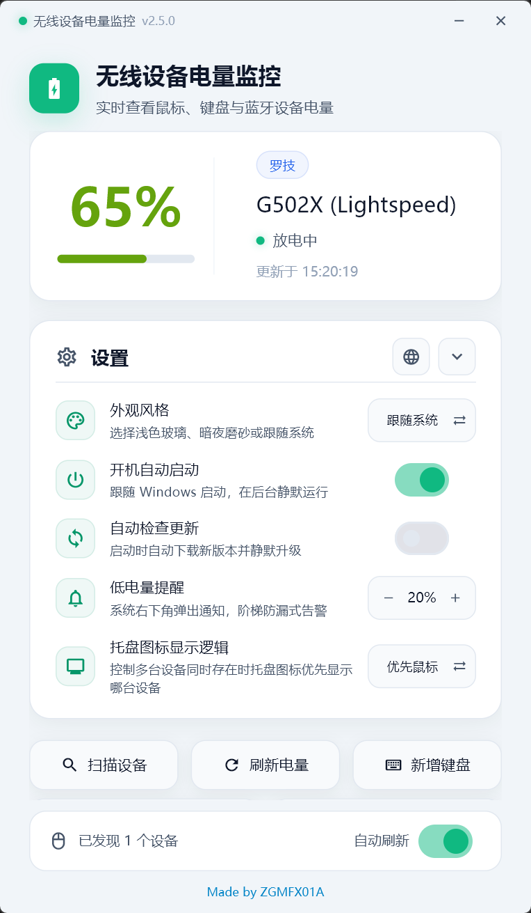

# 无线设备电量监控｜Windows 无线鼠标、键盘与蓝牙电量监控

[English](README.en.md)

**无线设备电量监控（Wireless Device Battery Monitor）** 是一个轻量、常驻 Windows 系统托盘的电量监控工具，用于查看 Logitech、Razer、ASUS ROG 无线鼠标键盘、机械键盘和兼容蓝牙设备的实时电量、充电状态和低电量提醒。

## 立即下载

- [下载最新 Windows 版本（GitHub Releases）](https://github.com/ZGMFX01A/mouse-battery/releases)
- [查看所有版本与更新说明](https://github.com/ZGMFX01A/mouse-battery/releases)

下载 `WirelessDeviceBatteryMonitor-<version>.exe` 后直接运行，无需安装器。程序启动后会驻留在 Windows 系统托盘。

## 产品截图

截图展示了多设备电量卡片、充电状态、低电量通知阈值、开机自启、自动更新、托盘图标优先级和手动刷新等功能。

## 为什么使用无线设备电量监控？

- **一眼查看电量**：在托盘图标或设置窗口中查看设备名称、电量百分比、充电状态和最近更新时间。
- **适合无线外设**：面向 Logitech、Razer、ASUS ROG 2.4G/Omni 无线鼠标和部分 HID 无线外设设计。
- **低电量提醒**：在关闭、10%、20%、30% 四档中选择提醒阈值，减少工作或游戏中突然断电的情况。
- **多设备管理**：可同时展示多个已识别设备，也可添加多个 Windows 已配对的标准 BLE 电量设备。
- **键盘扩展**：支持 ASUS ROG 无线机械键盘（直连 / Omni）以及 Weikav（华奋达）双 8K 方案机械键盘的电量读取与绑定。
- **轻量常驻**：系统托盘运行，支持扫描设备、手动刷新、会话级自动刷新、开机自启和中英文界面。
- **可选自动更新**：从 GitHub Releases 检查新版本并完成更新，是否启用由用户决定。

这些能力也使它适合作为 Windows mouse battery monitor、wireless mouse battery checker、Logitech battery monitor、Razer battery monitor、ASUS ROG battery monitor、HID battery utility 和 Bluetooth LE battery monitor 使用。

## 支持范围

### Razer 无线鼠标

| 设备 | 连接方式 | 状态 |
| --- | --- | --- |
| Basilisk V3 Pro（巴塞利斯蛇 V3 Pro） | 2.4G 无线接收器 | ✅ 已验证 |
| Viper V2 Pro（毒蝰 V2 Pro） | 2.4G 无线接收器 | 🔧 理论支持 |
| DeathAdder V3 Pro（蝰蛇 V3 Pro） | 2.4G 无线接收器 | 🔧 协议支持 |
| DeathAdder V3（蝰蛇 V3） | 2.4G 无线接收器 | 🔧 协议支持 |
| Viper Ultimate（毒蝰终极版） | 2.4G 无线接收器 | 🔧 协议支持 |
| Basilisk X Hyperspeed（巴塞利斯蛇 X 极速版） | 2.4G 无线接收器 | 🔧 协议支持 |
| Basilisk Ultimate（巴塞利斯蛇终极版） | 2.4G 无线接收器 | 🔧 协议支持 |
| DeathAdder V2 Pro（蝰蛇 V2 Pro） | 2.4G 无线接收器 | 🔧 协议支持 |

### Logitech 无线鼠标

| 设备 | 连接方式 | 状态 |
| --- | --- | --- |
| G903 | LIGHTSPEED | ✅ 已支持 |
| G502 X | LIGHTSPEED | ✅ 已支持 |
| G703 | LIGHTSPEED | 🔧 理论支持 |
| G Pro Wireless | LIGHTSPEED | 🔧 理论支持 |

Logitech 设备的电量读取可能会与 Logitech G HUB 争用 HID 接口。读取失败时，请先退出 G HUB，再点击“刷新电量”。当前代码按已知接收器 PID 枚举 Lightspeed、Bolt 和 Unifying 接收器，具体鼠标仍取决于设备暴露的 HID++ 电量能力。

### ASUS ROG 2.4G / Omni 无线鼠标

| 设备系列 / 型号 | 连接方式 | 状态 |
| --- | --- | --- |
| ROG Harpe Ace 系列（Aim Lab / Extreme / Mini / II Ace） | 2.4G 接收器 / Omni 接收器 | ✅ 已支持 |
| ROG Keris 系列（Wireless / AimPoint / II Ace / Origin） | 2.4G 接收器 / Omni 接收器 | ✅ 已支持 |
| ROG Gladius III 系列（Wireless / AimPoint / EVA-02） | 2.4G 接收器 / Omni 接收器 | ✅ 已支持 |
| ROG Gladius II Wireless / Strix Carry | 2.4G 接收器 | ✅ 已支持 |
| ROG Chakram / Chakram X Wireless | 2.4G 接收器 | ✅ 已支持 |
| ROG Spatha X Wireless | 2.4G 接收器 | ✅ 已支持 |
| ROG Pugio II / Strix Impact II / Impact III | 2.4G 接收器 / Omni 接收器 | ✅ 已支持 |

直连 2.4G 鼠标与 Omni 鼠标均自动识别。设备开机或从休眠唤醒后会自动同步电量；设备关机或休眠时，状态卡片将明确提示“未连接或处于休眠状态”，不会伪造历史电量。

### ASUS ROG 无线机械键盘

| 设备系列 / 型号 | 连接方式 | 状态 |
| --- | --- | --- |
| ROG Azoth 系列（Azoth / Extreme / Extreme SE / X） | 2.4G 接收器 / Omni 接收器 | ✅ 已支持（通过“新增键盘”绑定） |
| ROG Strix Scope 系列（Scope RX TKL / Scope II 96 / 96 RX） | 2.4G 接收器 / Omni 接收器 | ✅ 已支持（通过“新增键盘”绑定） |
| ROG Falchion RX Low Profile | Omni 接收器 | ✅ 已支持（通过“新增键盘”绑定） |

直连 2.4G 与 Omni 键盘均可在设置窗口中通过“新增键盘”一键识别并保存绑定。键盘休眠或断开连接时同样会显示离线休眠状态。

### Bluetooth LE 设备

支持已经与 Windows 配对、并向系统公开标准 Bluetooth Battery Service 的设备：

- Battery Service：`GATT 0x180F`
- Battery Level：`GATT 0x2A19`
- 可添加多个设备；设备休眠时仍会保留在候选列表中

仅使用厂商私有蓝牙协议，或没有向 Windows 暴露标准电量服务的设备，不属于当前支持范围。

### Weikav 双 8K 机械键盘

当前针对通过 2.4G 接收器连接的 Weikav（华奋达）双 8K 方案。由于键盘可能暴露多个 HID 接口，需要在设置窗口中使用“新增键盘”完成一次手动绑定。

## 快速开始

1. 打开 [Releases](https://github.com/ZGMFX01A/mouse-battery/releases)，下载最新的 `WirelessDeviceBatteryMonitor-<version>.exe`。
2. 双击运行程序，确认 Windows 系统托盘出现“无线设备电量监控”图标。
3. 使用 2.4G 接收器连接鼠标或键盘；BLE 设备先在 Windows 中完成配对。
4. 等待首次扫描；需要时点击“刷新电量”。
5. 将鼠标悬停在托盘图标上，或打开设置窗口查看详细状态。

如果 Windows SmartScreen 首次拦截未签名程序，请确认文件来自本仓库的 Releases，再选择“仍要运行”。

## 常用操作

### 查看设备电量

设置窗口会为每个设备显示名称、电量百分比、充电状态和更新时间。托盘图标可按以下策略显示设备：

- 鼠标优先
- 键盘优先
- 显示电量最低的设备

### 设置低电量提醒

在设置窗口使用减号/加号调整提醒阈值，可选择关闭、10%、20% 或 30%。达到阈值时，Windows 会弹出低电量通知；修改阈值后，程序会重新计算通知状态。

### 控制自动刷新

底部“自动刷新”开关控制当前设置窗口会话的状态同步，默认开启，约每 3 秒从托盘进程读取一次共享状态；托盘硬件轮询默认每 60 秒执行一次。该开关不会写入配置，重启后恢复开启。

### 添加 BLE 设备

1. 先在 Windows 蓝牙设置中完成设备配对。
2. 打开“无线设备电量监控”设置窗口。
3. 点击“添加蓝牙设备”，等待 Windows 已配对设备列表加载。
4. 选择公开标准 Battery Service 的设备并保存。

已添加的蓝牙设备卡片可以单独移除，之后可从已配对设备列表重新添加。

### 绑定机械键盘

1. 确认键盘通过 2.4G 接收器或 Omni 接收器连接。
2. 打开设置窗口并点击“新增键盘”。
3. 等待候选接口扫描完成（自动识别 ASUS ROG 无线键盘及 Weikav 双 8K 键盘）。
4. 选择目标键盘并保存绑定。

### 开机自启与自动更新

两项功能都可以在设置窗口单独开关。开机自启使用当前用户的 Windows 启动项；自动更新只在用户开启后检查 GitHub Releases。

### 切换界面语言

点击设置卡片右上角的语言按钮即可在简体中文和 English 之间切换；默认会根据 Windows UI 语言选择界面语言。

## 常见问题

### 检测不到鼠标怎么办？

请依次确认：

1. Logitech、Razer、ASUS ROG 鼠标通过 2.4G / Omni 无线接收器连接；标准 BLE 设备则通过“添加蓝牙设备”流程绑定。
2. 设备属于支持列表或同一协议系列。
3. Logitech 用户已经退出 G HUB。
4. 点击“刷新电量”；若 HID 接口仍被占用，可尝试以管理员身份运行。

### 电量显示为 N/A 或长时间不更新？

设备可能正在休眠、刚刚连接、尚未完成首次扫描，或暂时无法访问 HID 接口。先点击“刷新电量”，并等待下一次自动刷新。程序不会把无法读取的数据伪装成有效电量。

### 为什么官方驱动和本程序的电量不完全一样？

少量差异通常来自刷新时间点、设备休眠状态或百分比换算方式。请以同一时刻的数据进行比较。

### BLE 设备为什么搜不到？

只有已与 Windows 配对、并公开标准 `0x180F` / `0x2A19` 电量服务的设备才会出现在“添加蓝牙设备”候选列表中。程序会合并同一物理设备的多个 Windows 端点；厂商私有协议或不公开电量的设备无法通过通用 BLE 方式读取。

### 设置窗口提示“读取设备状态失败”怎么办？

设置窗口只读取托盘进程写入的共享状态，不直接访问 HID。请确认主程序仍在运行，再点击“刷新电量”；如果托盘进程已退出，请重新启动主程序。

### 自动更新访问哪些网络？

开启自动更新后，程序会访问本项目的 GitHub Releases 检查版本并下载更新。GitHub 直链不可用时，更新模块可能使用备用下载源；应用不会要求账号，也不会上传鼠标、键盘或电量数据。

## 搜索关键词

Windows 无线鼠标电量监控、Windows 鼠标电池监控、Logitech G903 电量、Logitech G502 X 电量、Razer 鼠标电量、ASUS ROG 鼠标电量、ROG 键盘电量、ROG Omni Receiver、无线键盘电量、机械键盘电量、Bluetooth LE Battery Service、HID++ 电量、系统托盘电量工具、低电量提醒、Windows battery monitor、mouse battery checker、ASUS ROG battery monitor。

## 隐私、安全与许可证

- 应用不需要登录，不收集账号信息，也不会上传设备名称、电量或 HID 数据。
- 访问网络仅用于 GitHub Releases 的版本检查和更新下载。
- 本项目采用非商业使用许可证。允许个人学习、修改和非商业运行；商业销售、付费分发、商业集成、企业收费部署及其他营利性用途均需事先取得版权所有者书面授权。
- 详细条款请阅读 [LICENSE](LICENSE)。

## 反馈与贡献

遇到设备兼容性问题时，请在 Issue 中提供 Windows 版本、设备型号、连接方式、程序版本和复现步骤。不要上传个人文件、完整 HID 原始数据或其他敏感信息。

欢迎通过 Issue 反馈兼容性信息和使用体验；协议实现与私有核心包不在本公开仓库中维护。
